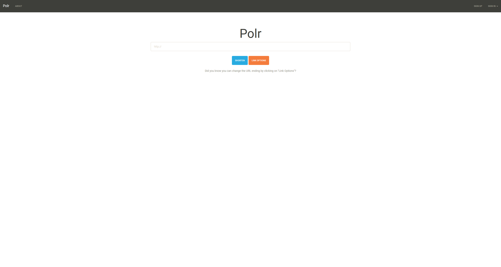

# Báo cáo thực hành Công nghệ mới  
* Họ và tên: Đinh Hoàng Hải Đăng
* MSSV: 17100261
* Hosting server: Amazon Web Services (AWS)
* Ứng dụng: [Phần mềm rút gọt link Polr](https://github.com/cydrobolt/polr)
* Link web: [http://54.179.39.47](http://54.179.39.47)

### Sử dụng:

- Dán link muốn rút gọn vào, server sẽ lưu đường dẫn đó lại kèm theo trả về một đường dẫn ngẫu nhiên của server:

- Ta có thể tùy biến đường dẫn ngẫu nhiên ấy thông qua phần `link options`, đồng thời có thể biến link đó từ công khai sang bí mật bằng việc nhấn vào nút `secret`.

## Dành cho lập trình viên:
- Có 2 API chính đó là Tạo link rút gọn và kiểm tra link:
- Tạo link:
  - Ví dụ: `http://18.141.192.162/api/v2/action/shorten?key=d34eb99d07f810ce13213405981918&url=https://google.com&custom_ending=test_custom&is_secret=false`
  - Với `key` là khóa bí mật của mỗi tài khoản, `url` là link cần rút gọn, `custom_ending` là phần link mình tự điều chỉnh, `is_secret` quyết định đây có phải link bí mật hay không
- Kiểm tra link:
  - Ví dụ: `http://18.141.192.162/api/v2/action/lookup?key=d34eb99d07f810ce13213405981918&url_ending=test_custom`
  - Với `key` là khóa bị mật của mỗi tài khoản, `url_ending` là phần đuôi của link server cần kiểm tra

## Công nghệ:
- Web được deploy bằng Apache2 server.
- Backend của trang web được code bằng ngôn ngữ lập trình PHP.
- Database mà website sử dụng là Mysql.
